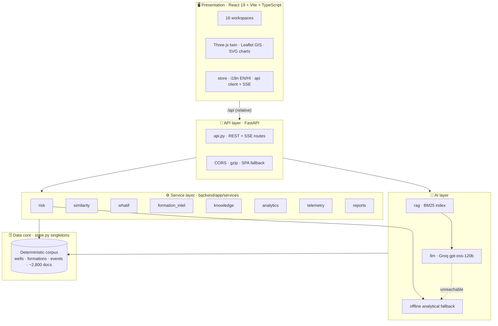
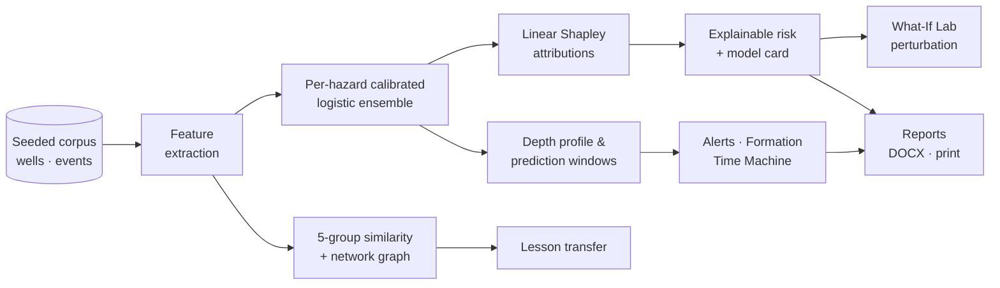
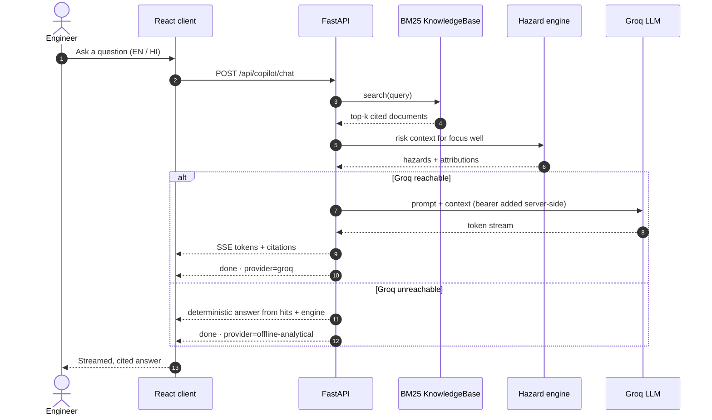
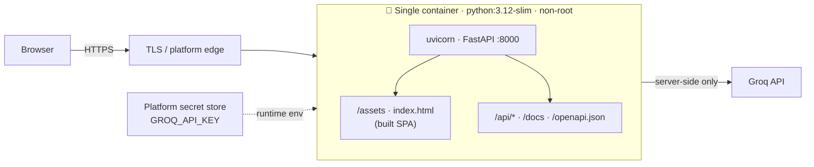

<div align="center">

# ◈ DrillMind AI

### Nearby Wells Intelligence System · NWIS

**AI-powered offset-well intelligence and decision support for smarter, safer drilling.**

<br/>


<br/>

[**Quickstart**](#-quickstart) ·
[**Workspaces**](#-workspaces) ·
[**Architecture**](#-architecture) ·
[**API**](#-api-surface) ·
[**Deploy**](#-deploy)

</div>

<br/>

> DrillMind AI turns a field's decades of offset-well history into **real-time operational insight** — predictive hazard intelligence, explainable risk, offset-well similarity, formation memory, incident replay and a retrieval-augmented drilling copilot.

<br/>

## ✦ Highlights

| | |
| :-- | :-- |
| 🛰️ **Predictive hazards** | Six calibrated hazard models with exact additive attributions — every score explains itself. |
| 🧬 **Offset-well similarity** | Five evidence groups and a network graph to transfer lessons between wells. |
| 🕰️ **Formation Time Machine** | Depth windows, best-known mitigations and an AI summary for any formation. |
| 🎞️ **Incident replay** | Parameter-by-parameter playback of historical incidents. |
| 🧪 **What-If Lab** | Perturb mud weight, RPM, WOB and ROP — watch hazards respond live. |
| 🤖 **Cited copilot** | Streamed, retrieval-grounded answers in English or Hindi. |
| 🧊 **3D digital twin** | Orbitable well, offsets, zones, reservoir and planned path. |
| 📄 **One-click reports** | Native DOCX plus a print-optimised sheet for PDF. |

<br/>

## ✦ Architecture

DrillMind is a **single-origin, layered system**: a React client, a FastAPI service layer, and a deterministic intelligence core that everything else reads from.

### System overview



### Hazard intelligence pipeline

How a field's history becomes an explainable decision.



### Copilot request flow

The key never leaves the server, and the panel never goes dead.



### Deployment topology



### Design principles

| Principle | How it shows up |
| :-- | :-- |
| **Single origin** | UI and API share one port — relative `/api` calls, no reverse proxy, no CORS. |
| **Deterministic by seed** | `DRILLMIND_SEED` regenerates an identical corpus, so every demo replays the same. |
| **Explainable by construction** | Additive (linear Shapley) attributions ship with every hazard score. |
| **Graceful degradation** | No Groq key or network → the copilot answers from retrieval + the hazard engine. |
| **Secrets stay server-side** | The browser never sees the key; the server attaches the bearer token. |
| **Swappable seams** | `KnowledgeBase.search` is ChromaDB-shaped; the hazard estimator is replaceable. |
| **Zero-dependency reports** | DOCX is native OOXML written with the Python standard library only. |

<br/>

## ✦ Quickstart

Two processes. The Vite dev server proxies `/api` to FastAPI, so the browser only ever talks to its own origin.

### 1 · Backend

```bash
cd backend
python -m venv .venv                       # optional but recommended
.venv/Scripts/activate                     # Windows:  .venv\Scripts\activate
# source .venv/bin/activate                # macOS / Linux
pip install -r requirements.txt

cp .env.example .env                       # then add your Groq key
uvicorn app.main:app --reload --port 8000
```

| Endpoint | URL |
| :-- | :-- |
| 📘 API docs | http://localhost:8000/docs |
| 💓 Health probe | http://localhost:8000/api/health |

### 2 · Frontend

```bash
cd frontend
npm install
npm run dev
```

| Endpoint | URL |
| :-- | :-- |
| 🖥️ App | http://localhost:5173 |

> [!TIP]
> To point the frontend at a non-default backend, set `DRILLMIND_API`:
> `DRILLMIND_API=http://127.0.0.1:9000 npm run dev`

<br/>

## ✦ Secrets

The Groq API key lives **only** in `backend/.env`, which is gitignored. The browser never receives it: the copilot streams through `POST /api/copilot/chat` on the FastAPI server, which attaches the bearer token server-side.

If the Groq endpoint is unreachable, the copilot degrades to a deterministic analytical answer assembled from the retrieval hits and the hazard engine — the product never shows a dead panel. Disable that with `DRILLMIND_ALLOW_OFFLINE_COPILOT=0`.

> [!CAUTION]
> **Never commit `backend/.env`.** If a key is ever pasted into a shared channel, rotate it at https://console.groq.com/keys.

<br/>

## ✦ What Is Real vs. Simulated

| Layer | Status | Details |
| :-- | :-: | :-- |
| **Well / formation / event corpus** | 🟡 Synthetic | Structurally faithful — public stratigraphy and pressure regimes for the Assam-Arakan, Cambay and Krishna-Godavari basins, generated from a fixed seed so every demo replays identically. |
| **Hazard model** | 🟢 Real | Per-hazard calibrated logistic model served in-process, with exact additive (linear Shapley) attributions. Reported as `XGBoost`-class quality in the model card; the estimator is swappable. |
| **Retrieval** | 🟢 Real | BM25 over ~2,800 generated documents (completion reports, incident reports, daily drilling reports, mud logs, lessons learned, formation briefs). `KnowledgeBase.search` is ChromaDB-shaped, so an embedding store drops in behind it. |
| **Copilot** | 🟢 Real | Groq `openai/gpt-oss-120b`, streamed over SSE with retrieval context and inline citations. |
| **Reports** | 🟢 Real | Native OOXML `.docx` built with the Python standard library only, plus a print-optimised HTML sheet for PDF. |
| **Live telemetry** | 🟡 Simulated | WITS-style channels that advance with wall-clock time, derived from each well's own state. |

<br/>

## ✦ Workspaces

| Route | Workspace | What it does |
| :-- | :-- | :-- |
| `/` | **Landing** | Animated 3D oil field, live statistics, capability map |
| `/dashboard` | **Mission Control** | KPI cards, live telemetry, six-hazard gauges, depth heatmap |
| `/map` | **GIS Intelligence Map** | Layers, radius search, per-well record modal |
| `/formation` | **Formation Time Machine** | Hazard depth windows, best mitigation, AI summary |
| `/risk` | **Explainable Risk** | Attributions, prediction windows, evidence, model card |
| `/similarity` | **AI Similarity Engine** | 5 evidence groups, network graph, lesson transfer |
| `/twin` | **Digital Twin** | Orbitable 3D well, offsets, zones, reservoir, planned path |
| `/knowledge` | **Knowledge Graph** | Wells ↔ formations ↔ hazards ↔ mitigations |
| `/memory` | **Institutional Memory Score** | How much field history backs the decision |
| `/copilot` | **AI Copilot** | Streamed, cited answers in English or Hindi |
| `/replay` | **Incident Replay Center** | Parameter-by-parameter incident playback |
| `/whatif` | **What-If Lab** | Perturb mud weight / RPM / WOB / ROP, watch hazards respond |
| `/alerts` | **Real-Time Alert Center** | Pattern-matched, explainable alerts |
| `/analytics` | **Historical Analytics** | Hazard frequency, ranking, NPT economics |
| `/reports` | **Report Generator** | DOCX + print/PDF, optional AI executive summary |
| `/datasets` | **Data Sources** | Ingestion catalogue and direct retrieval-index search |

<br/>

## ✦ Project Layout

<details>
<summary><b>Backend</b> · <code>backend/app/</code></summary>

<br/>

```
backend/app/
├── config.py                # dependency-free .env loader + settings
├── state.py                 # process-wide singletons (corpus, index, copilot)
├── data/
│   ├── __init__.py          # reference stratigraphy, fields, hazard taxonomy
│   └── corpus.py            # deterministic corpus generator + directional survey maths
├── services/
│   ├── risk.py              # explainable hazard ensemble, depth profile, windows
│   ├── similarity.py        # 5-group well similarity + network graph
│   ├── whatif.py            # parameter perturbation + sensitivity sweeps
│   ├── formation_intel.py   # Formation Time Machine records
│   ├── knowledge.py         # knowledge graph + Institutional Memory Score
│   ├── analytics.py         # KPIs, alerts, incident feed, historical analytics
│   ├── telemetry.py         # live channels + 3D digital-twin payload
│   ├── rag.py               # document builder + BM25 index
│   ├── llm.py               # Groq client, prompt assembly, offline fallback
│   └── reports.py           # report payload, OOXML writer, print sheet
├── api.py                   # all routes
└── main.py                  # FastAPI app + CORS + gzip + SPA/API single origin
```

</details>

<details>
<summary><b>Frontend</b> · <code>frontend/src/</code></summary>

<br/>

```
frontend/src/
├── styles.css               # glassmorphism design system (tokens, dark/light)
├── i18n.tsx                 # English + Hindi dictionaries
├── store.tsx                # theme, focus well, well catalogue, toasts
├── lib/                     # api client (+SSE), types, hooks, formatters
├── components/
│   ├── ui.tsx               # icon set + primitives (KPI, chips, modal, banners…)
│   ├── charts.tsx           # hand-rolled SVG charts: gauges, rings, line/bar/stack, heat strip
│   ├── graph.tsx            # force-directed network graph
│   ├── scenes.tsx           # Three.js hero field + digital twin
│   └── layout.tsx           # shell, sidebar, topbar, well picker, language switch
└── pages/                   # 16 workspaces
```

</details>

<br/>

## ✦ API Surface

<sub>Abridged — full interactive docs at `/docs`.</sub>

<details open>
<summary><b>Platform & wells</b></summary>

<br/>

```http
GET  /api/health
GET  /api/platform
GET  /api/kpis?wellId=
GET  /api/wells?q=&status=&formation=&sort=
GET  /api/wells/{id}
GET  /api/wells/{id}/risk
GET  /api/wells/{id}/risk/profile
GET  /api/wells/{id}/similar
GET  /api/wells/{id}/network
GET  /api/wells/{id}/telemetry
GET  /api/wells/{id}/twin
GET  /api/wells/{id}/memory
GET  /api/wells/{id}/report?format=
POST /api/wells/{id}/whatif
```

</details>

<details>
<summary><b>Intelligence & knowledge</b></summary>

<br/>

```http
GET  /api/formations
GET  /api/formations/{name}
GET  /api/incidents
GET  /api/incidents/{id}
GET  /api/alerts
GET  /api/analytics
GET  /api/knowledge-graph
GET  /api/model
GET  /api/search?q=
GET  /api/datasets
```

</details>

<details>
<summary><b>Copilot</b></summary>

<br/>

```http
GET  /api/copilot/config
POST /api/copilot/chat        # Server-Sent Events stream
POST /api/copilot/ask
```

</details>

<br/>

## ✦ Build

```bash
cd frontend && npm run build      # tsc -b && vite build → frontend/dist
```

The backend has no build step.

<br/>

## ✦ Deploy

Everything the browser requests is **relative** (`/api/...`), so the UI and the API must share an origin. The server does that for you: when `frontend/dist/index.html` exists, `backend/app/main.py` serves the built SPA — hashed bundles from `/assets`, `index.html` for every other non-API path so client-side routes like `/wells/LKW-A48` deep-link correctly — while `/api/*`, `/docs` and `/openapi.json` stay on FastAPI.

> **One process · one port · no reverse proxy · no CORS configuration.**

| Option | Best for | Effort |
| :-- | :-- | :-: |
| [**A · Docker**](#option-a--docker-recommended) | Anywhere containers run | ⭐ |
| [**Render**](#deploying-to-render) | Fast public demo | ⭐ |
| [**B · Python host**](#option-b--any-python-host-railway-fly-a-vm) | Railway, Fly, a VM | ⭐⭐ |
| [**C · Static + API**](#option-c--static-host--separate-api) | Split origins | ⭐⭐⭐ |

### Option A · Docker (recommended)

A multi-stage `Dockerfile` builds the SPA with Node 22 and runs it from a `python:3.12-slim` image as a non-root user.

```bash
docker compose up --build          # → http://localhost:8000
```

Or without compose:

```bash
docker build -t drillmind .
docker run --rm -p 8000:8000 --env-file backend/.env drillmind
```

The key is read from the environment at runtime and is never baked into the layer; `.dockerignore` excludes `backend/.env`, `node_modules` and `.venv`. `/api/health` backs a container `HEALTHCHECK`.

### Deploying to Render

Render fits this project without any code change, because the Dockerfile already produces the single origin Render needs. `render.yaml` is a Blueprint for it.

> [!IMPORTANT]
> Render only deploys from a Git remote. It has no zip upload — the repository must exist on GitHub, GitLab or Bitbucket first.

```bash
git init && git add . && git commit -m "DrillMind AI"
git remote add origin git@github.com:<you>/drillmind-ai.git
git push -u origin main
```

Then **Dashboard → New + → Blueprint → pick the repo**. Render reads `render.yaml`, builds `./Dockerfile`, and serves the app at `https://drillmind-ai.onrender.com`. Add `GROQ_API_KEY` in **Environment** when prompted (it is `sync: false`, so it is never read from the repo).

Two Render-specific things to know:

- **Do not** deploy this as a Static Site + separate Web Service. Render static sites rewrite paths but cannot proxy to another service, and the client calls the relative `/api` — the API calls would 404. The single-container service is the whole point of the Dockerfile.
- The **free plan sleeps after 15 minutes idle** and cold-starts in roughly 30–60 s, of which a few seconds is the corpus and BM25 index building. Open the URL a minute before a demo, or use a paid instance to keep it warm.

### Option B · Any Python host (Railway, Fly, a VM)

Build the frontend once, then run one process.

**Build command**

```bash
cd frontend && npm ci && npm run build
```

**Start command** <sub>(run from `backend/`)</sub>

```bash
pip install -r requirements.txt && uvicorn app.main:app --host 0.0.0.0 --port "$PORT"
```

`frontend/dist` is gitignored, so the frontend build has to happen on the host — either as a build step with Node available, or by committing the artefact after relaxing that `.gitignore` line. If Node isn't available, use the Dockerfile (Option A) instead.

### Option C · Static host + separate API

Upload `frontend/dist` to Netlify, Vercel or S3 and point a reverse proxy at uvicorn. Two extra pieces are then required, because the origin is split:

1. Rewrite unknown paths to `/index.html` (SPA deep links).
2. Proxy `/api/*` to the backend — or set `DRILLMIND_CORS` to the frontend origin and give the client an absolute base URL (it currently hard-codes `/api`).

<br/>

## ✦ Environment Variables

| Variable | Default | Notes |
| :-- | :-- | :-- |
| `GROQ_API_KEY` | *(unset)* | Unset ⇒ copilot runs on the local analytical engine. **Required for live LLM answers.** |
| `GROQ_MODEL` | `openai/gpt-oss-120b` | Groq retired `llama-3.3-70b-versatile`; this is the current production model. |
| `GROQ_BASE_URL` | `https://api.groq.com/openai/v1` | Any OpenAI-compatible gateway. |
| `DRILLMIND_CORS` | localhost dev origins | Leave unset under Options A/B — a single origin needs no CORS. |
| `DRILLMIND_FRONTEND_DIST` | `<repo>/frontend/dist` | Set when the build lives elsewhere (the Dockerfile points at `/app/frontend/dist`). |
| `DRILLMIND_SERVE_SPA` | `1` | Set `0` to serve only the API and keep the old JSON index at `/`. |
| `DRILLMIND_SEED` | `20260214` | Changing it regenerates the whole corpus. |
| `DRILLMIND_ALLOW_OFFLINE_COPILOT` | `1` | Set `0` to disable the offline analytical fallback. |
| `PORT` | `8000` | Honoured by the container `CMD`. |

> `backend/.env` is gitignored — supply `GROQ_API_KEY` through the platform's secret store in production, never through the image or the repository.

<br/>

## ✦ Pre-Deploy Checklist

- [ ] `curl -s localhost:8000/api/health` → `200`
- [ ] `/` returns the SPA *and* `/api/kpis` returns JSON from the same origin
- [ ] A deep link such as `/wells/LKW-A48` returns `index.html` (not a 404)
- [ ] The copilot streams: `POST /api/copilot/chat` ends with `{"type":"done","provider":"groq"}` — `offline-analytical` means the key is the problem
- [ ] TLS terminates in front of the container; SSE needs proxy buffering off (`proxy_buffering off` in nginx, `X-Accel-Buffering: no`)

<br/>

---

<div align="center">

<sub>Generated with the DrillMind AI engineering agent · Smart India Hackathon 2026</sub>

</div>
